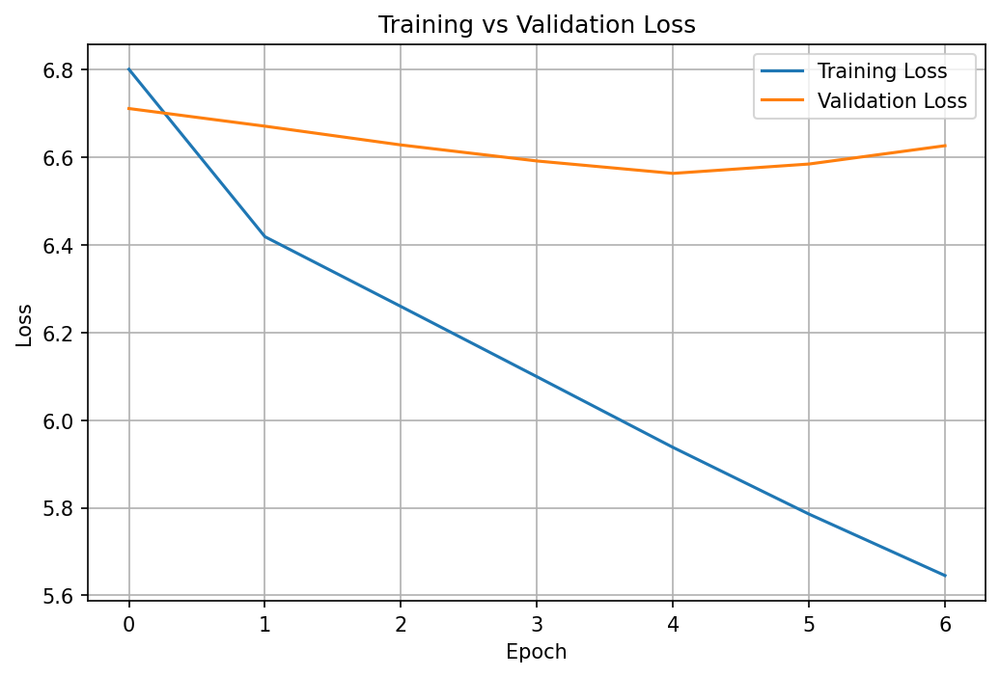

<div align="center">

# Shakespeare LSTM Text Generator

### Word-Level Language Modeling with LSTM · Temperature · Top-K Sampling

<p>
  An end-to-end Generative AI / NLP project that learns Shakespeare-style
  next-word patterns and generates text from user-provided seed phrases.
</p>

<p>
  
  
  
  
  
</p>

</div>

---

## ✨ Project Overview

This project implements a **word-level LSTM language model** using
**TensorFlow/Keras**.

The model is trained on a subset of Shakespeare's complete works and learns
to predict the **next word from a sequence of previous words**.

### End-to-End Pipeline

<table>
<tr>
<td align="center">📚<br><b>Shakespeare Corpus</b></td>
<td>→</td>
<td align="center">🧹<br><b>Text Cleaning</b></td>
<td>→</td>
<td align="center">🔤<br><b>Tokenization</b></td>
<td>→</td>
<td align="center">📖<br><b>Vocabulary</b></td>
</tr>
<tr>
<td align="center">⬇️</td>
<td></td>
<td align="center">⬇️</td>
<td></td>
<td align="center">⬇️</td>
<td></td>
<td align="center">⬇️</td>
</tr>
<tr>
<td align="center">🎯<br><b>Training Pairs</b></td>
<td>→</td>
<td align="center">🧠<br><b>Embedding</b></td>
<td>→</td>
<td align="center">🔁<br><b>LSTM</b></td>
<td>→</td>
<td align="center">🎲<br><b>Sampling</b></td>
</tr>
</table>

The final stage uses **temperature and Top-K sampling** to generate new
Shakespeare-style text.

---

## 🎯 What This Project Demonstrates

<table>
<tr>
<th>Area</th>
<th>Implementation</th>
</tr>
<tr>
<td>Text Processing</td>
<td>Lowercasing, punctuation removal and word tokenization</td>
</tr>
<tr>
<td>Language Modeling</td>
<td>Next-word prediction from fixed-length contexts</td>
</tr>
<tr>
<td>Deep Learning</td>
<td>Embedding + LSTM + Dropout + Dense Softmax</td>
</tr>
<tr>
<td>Training</td>
<td>Adam optimizer, validation monitoring and early stopping</td>
</tr>
<tr>
<td>Generation</td>
<td>Autoregressive next-word generation</td>
</tr>
<tr>
<td>Sampling</td>
<td>Temperature and Top-K sampling</td>
</tr>
<tr>
<td>Experimentation</td>
<td>Sequence-length comparison: 20 vs 30 words</td>
</tr>
<tr>
<td>Reproducibility</td>
<td>Saved vocabulary, metrics, outputs and checkpoint</td>
</tr>
</table>

---

## 📊 Project Snapshot

<table>
<tr>
<td align="center"><b>120K</b><br>Training Tokens</td>
<td align="center"><b>8K</b><br>Vocabulary</td>
<td align="center"><b>128</b><br>LSTM Units</td>
<td align="center"><b>20</b><br>Context Words</td>
</tr>
<tr>
<td align="center"><b>53,991</b><br>Training Examples</td>
<td align="center"><b>5,999</b><br>Validation Examples</td>
<td align="center"><b>6.5629</b><br>Best Val Loss</td>
<td align="center"><b>5</b><br>Best Epoch</td>
</tr>
</table>

---

## 📚 Dataset

The project uses **The Complete Works of William Shakespeare**, Project
Gutenberg eBook #100.

**Dataset:** https://www.gutenberg.org/ebooks/100

The training script automatically downloads the plain-text dataset and
stores it locally:

```text
data/shakespeare.txt
```

The dataset is excluded from Git because it can be recreated automatically.

### Dataset Statistics

| Metric | Value |
|---|---:|
| Tokens used | 120,000 |
| Vocabulary size | 8,000 |
| Training examples | 53,991 |
| Validation examples | 5,999 |
| Baseline context length | 20 words |

---

## 🧠 Model Architecture

<table>
<tr>
<td align="center" width="20%"><b>Input</b><br>20 word IDs</td>
<td align="center">→</td>
<td align="center" width="20%"><b>Embedding</b><br>128 dimensions</td>
<td align="center">→</td>
<td align="center" width="20%"><b>LSTM</b><br>128 units</td>
<td align="center">→</td>
<td align="center" width="20%"><b>Dropout</b><br>0.20</td>
</tr>
<tr>
<td colspan="7" align="center">↓</td>
</tr>
<tr>
<td colspan="3"></td>
<td align="center" width="20%"><b>Dense</b><br>8,000 classes</td>
<td align="center">→</td>
<td align="center" width="20%"><b>Softmax</b><br>Next-word probabilities</td>
<td></td>
</tr>
</table>

### Model Configuration

| Parameter | Value |
|---|---:|
| Tokenization | Word-level |
| Vocabulary | 8,000 |
| Sequence length | 20 |
| Embedding dimension | 128 |
| LSTM units | 128 |
| Dropout | 0.20 |
| Optimizer | Adam |
| Learning rate | 0.001 |
| Batch size | 128 |
| Maximum epochs | 12 |
| Loss | Sparse categorical cross-entropy |

---

## 🔄 How Text Generation Works

The model generates text **autoregressively**.

```text
Seed phrase
    ↓
Convert words → IDs
    ↓
Predict next-word probabilities
    ↓
Apply temperature
    ↓
Apply Top-K filtering
    ↓
Sample next word
    ↓
Append word to context
    ↓
Repeat
```

For example:

```text
Seed:
to be or not to be

        ↓

Predicted word:
...

        ↓

Append prediction

        ↓

Predict the next word
```

This process continues until the requested number of words is generated.

---

## 🎲 Temperature & Top-K Sampling

### Temperature

Temperature controls how conservative or diverse the generated text is.

| Temperature | Behavior |
|---:|---|
| `0.5` | More conservative and predictable |
| `0.8` | Balanced generation |
| `1.0` | More diverse generation |

### Top-K

Top-K sampling restricts the next-word choice to the **K most probable
tokens**.

The comparison script uses:

| Temperature | Top-K | Purpose |
|---:|---:|---|
| 0.5 | 10 | Conservative |
| 0.8 | 20 | Balanced |
| 1.0 | 40 | More diverse |

Run:

```bash
python generate_compare.py
```

---

## 📈 Training Results

### Baseline — Sequence Length 20

| Epoch | Training Loss | Validation Loss |
|---:|---:|---:|
| 1 | 6.8004 | 6.7109 |
| 2 | 6.4184 | 6.6706 |
| 3 | 6.2592 | 6.6278 |
| 4 | 6.0989 | 6.5912 |
| **5** | **5.9377** | **6.5629** |
| 6 | 5.7855 | 6.5842 |
| 7 | 5.6453 | 6.6260 |

### Best Result

<details>
<summary><b>View training summary</b></summary>

<br>

- **Best validation loss:** `6.5629`
- **Best epoch:** `5`
- **Early stopping:** Epoch `7`
- **Context length:** `20`
- **LSTM units:** `128`
- **Embedding dimension:** `128`
- **Vocabulary:** `8,000`

Validation loss improved until Epoch 5 and then increased while training loss
continued decreasing. Early stopping restored the best weights from Epoch 5.

</details>

---

## 📉 Training Curve

The baseline training run generates the following loss curve:

<p align="center">
  
</p>

<details>
<summary><b>What does the graph show?</b></summary>

<br>

The training loss continues to decrease throughout the run, while validation
loss reaches its best point around Epoch 5 and then starts increasing.

This indicates that the model begins to fit the training data more closely
without producing better validation performance.

The project therefore uses **early stopping** to restore the best-performing
weights.

</details>

---

## 🧪 Controlled Experiment — Sequence Length

A controlled experiment tested whether increasing the context window from
**20 to 30 words** improves next-word prediction.

### Results

<table>
<tr>
<th>Model</th>
<th>Sequence Length</th>
<th>Best Validation Loss</th>
<th>Best Epoch</th>
</tr>
<tr>
<td><b>Baseline</b></td>
<td><b>20</b></td>
<td><b>6.5629</b></td>
<td><b>5</b></td>
</tr>
<tr>
<td>Experiment</td>
<td>30</td>
<td>6.5827</td>
<td>5</td>
</tr>
</table>

### Result

```text
20-word context → 6.5629
30-word context → 6.5827
```

The 20-word baseline performed slightly better.

```text
Difference = 6.5827 - 6.5629 = 0.0198
```

The experiment therefore **did not show an improvement from increasing the
context length to 30 words** under the same training configuration.

Only the sequence length was changed. The vocabulary, embedding dimension,
LSTM units, optimizer, learning rate, batch size, dropout and early stopping
settings remained unchanged.

Run the experiment with:

```bash
python experiment_seq30.py
```

---

## ✍️ Generated Samples

### Seed 1

<details>
<summary><code>to be or not to be</code></summary>

```text
to be or not to be thy lord to be and your world is my love as the man
for thy son that you do a love so so s be a house and that was i shall
thee to the man i think i will
```

</details>

### Seed 2

<details>
<summary><code>shall i compare thee</code></summary>

```text
shall i compare thee thou am thee to be i be thee in her and i am the
heart of ephesus of i be so but i know me the good man you have not have
that be to you be all you must
```

</details>

### Seed 3

<details>
<summary><code>love is</code></summary>

```text
love is the room in you in thy man s the enter of the heart of my own
from your father s that be the gods shall the way the way to the man s
the man to the hand
```

</details>

> Some repetition and grammatical inconsistency are expected from a
> relatively small word-level LSTM trained on a limited corpus.

---

## 🗂️ Project Structure

```text
shakespeare-lstm-text-generator/
│
├── main.py
│   └── Main training + generation pipeline
│
├── generate_compare.py
│   └── Temperature + Top-K comparison
│
├── experiment_seq30.py
│   └── Sequence-length experiment
│
├── requirements.txt
├── README.md
├── .gitignore
│
├── data/
│   └── shakespeare.txt
│       └── Downloaded locally; ignored by Git
│
└── artifacts/
    ├── best_model.keras
    │   └── Best checkpoint; ignored by Git
    │
    ├── vocab.json
    │   └── Word ↔ ID mappings
    │
    ├── metrics.json
    │   └── Training metrics
    │
    ├── sample_outputs.txt
    │   └── Generated samples
    │
    └── training_curve.png
        └── Training vs validation loss
```

---

## 🛠️ Tech Stack

<p>
  
  
  
  
</p>

- Python
- TensorFlow / Keras
- NumPy
- Matplotlib
- LSTM
- Word-level language modeling

---

## 🚀 Setup & Installation

### Requirements

Recommended:

```text
Python 3.10 or Python 3.11
```

### 1. Clone the repository

```bash
git clone <repository-url>
cd shakespeare-lstm-text-generator
```

### 2. Create a virtual environment

#### Windows

```bash
python -m venv venv
venv\Scripts\activate
```

### 3. Install dependencies

```bash
pip install -r requirements.txt
```

---

## ▶️ Running the Project

### Train the model

```bash
python main.py
```

The main script:

- downloads the dataset if required
- preprocesses the corpus
- builds the vocabulary
- creates training sequences
- trains the LSTM
- validates the model
- applies early stopping
- saves the best checkpoint
- generates sample text
- saves metrics and the training curve

### Compare sampling strategies

```bash
python generate_compare.py
```

### Run the sequence-length experiment

```bash
python experiment_seq30.py
```

---

## 📦 Artifacts

| File | Purpose |
|---|---|
| `artifacts/best_model.keras` | Best validation-loss checkpoint |
| `artifacts/vocab.json` | Word-to-ID and ID-to-word mappings |
| `artifacts/metrics.json` | Training metrics and dataset statistics |
| `artifacts/sample_outputs.txt` | Generated text samples |
| `artifacts/training_curve.png` | Training vs validation loss |

The trained `.keras` model is excluded from Git to keep the repository
lightweight.

---

## ⚙️ Why These Design Choices?

<details>
<summary><b>Word-level tokenization</b></summary>

Word-level modeling directly demonstrates next-word prediction and keeps the
pipeline easy to inspect and explain.

</details>

<details>
<summary><b>20-word context</b></summary>

A 20-word context provides useful surrounding information while keeping CPU
training practical.

</details>

<details>
<summary><b>8,000-word vocabulary</b></summary>

A limited vocabulary reduces the size of the final Dense + Softmax layer and
keeps training manageable on a laptop.

</details>

<details>
<summary><b>128 LSTM units</b></summary>

Provides reasonable capacity for a small language model without making CPU
training unnecessarily expensive.

</details>

<details>
<summary><b>Early stopping</b></summary>

Prevents unnecessary training after validation performance stops improving.

</details>

<details>
<summary><b>Temperature + Top-K</b></summary>

Provides direct control over the trade-off between predictable and diverse
generated text.

</details>

---

## ⚠️ Limitations

This is an educational LSTM language model rather than a large-scale modern
language model.

- The model uses a limited subset of the Shakespeare corpus.
- LSTMs have weaker long-range context handling than modern Transformer
  architectures.
- Generated text can contain grammatical inconsistencies.
- `<UNK>` can appear for words outside the retained vocabulary.
- The model may repeat words or produce semantically inconsistent sequences.
- Generation quality depends on vocabulary size, context length, model
  capacity and training time.
- The model learns statistical word patterns rather than true semantic
  understanding.

---

## 🔮 Future Improvements

Potential improvements include:

- Train on the complete Shakespeare corpus.
- Increase vocabulary size.
- Compare additional context lengths.
- Compare LSTM with GRU.
- Experiment with stacked LSTM layers.
- Add Top-P / nucleus sampling.
- Compare sampling strategies quantitatively.
- Compare the LSTM with a small Transformer language model.
- Use GPU acceleration for larger datasets.
- Add an interactive web interface for text generation.

---

## 🔁 Reproducibility

A fixed random seed is used:

```python
SEED = 42
```

The project also saves:

- vocabulary mappings
- training metrics
- generated outputs
- best model checkpoint

This makes the workflow easier to reproduce and inspect.

---

## 💡 Interview Takeaways

This project demonstrates practical understanding of:

<table>
<tr>
<td>✓ Text preprocessing</td>
<td>✓ Word-level tokenization</td>
</tr>
<tr>
<td>✓ Vocabulary construction</td>
<td>✓ Sequence modeling</td>
</tr>
<tr>
<td>✓ Embeddings</td>
<td>✓ LSTM networks</td>
</tr>
<tr>
<td>✓ Next-word prediction</td>
<td>✓ Softmax probability distributions</td>
</tr>
<tr>
<td>✓ Sparse categorical cross-entropy</td>
<td>✓ Adam optimization</td>
</tr>
<tr>
<td>✓ Early stopping</td>
<td>✓ Model checkpointing</td>
</tr>
<tr>
<td>✓ Temperature sampling</td>
<td>✓ Top-K sampling</td>
</tr>
<tr>
<td>✓ Autoregressive generation</td>
<td>✓ Controlled experiments</td>
</tr>
</table>

---

## 📌 Quick Start

```bash
git clone <repository-url>
cd shakespeare-lstm-text-generator

python -m venv venv
venv\Scripts\activate

pip install -r requirements.txt

python main.py
```

Then:

```bash
python generate_compare.py
```

Or run the experiment:

```bash
python experiment_seq30.py
```

---

## 🏁 Conclusion

This project implements an end-to-end **word-level generative language
model using an LSTM**.

The final baseline achieved a **best validation loss of 6.5629** using a
20-word context. The controlled 30-word experiment achieved **6.5827**,
showing that a longer context did not improve validation performance under
the same training configuration.

The project combines:

**LSTM + Embeddings + Early Stopping + Checkpointing + Temperature +
Top-K Sampling + Controlled Experimentation**

The goal is to demonstrate the core principles of neural language modeling
and autoregressive text generation using LSTMs rather than reproduce the
scale or capabilities of modern Transformer-based LLMs.

---
